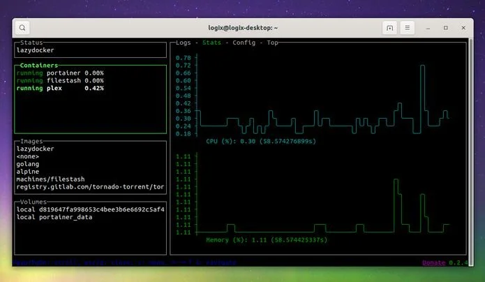
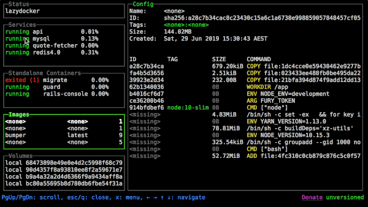

# Como instalar a interface de usuário para Docker LazyDocker no Linux

[LazyDocker](https://github.com/jesseduffield/lazydocker) é uma nova interface de usuário de terminal livre e de código aberto para Docker e Docker Compose.



Ela permite visualizar o estado de um ambiente de contêineres de composição de janela de encaixe ou Docker, exibir logs, reiniciar/remover/reconstruir contêineres ou serviços e muito mais.

A ferramenta foi escrita em Go, usando a biblioteca gocui (pacote Go minimalista destinada a criar interfaces de usuário de console com texto colorido, suporte a mouse, múltiplas visões, etc.), e pode ser usada tanto na máquina local quanto em um Docker remoto TUI (por SSH).

Seu objetivo é fornecer uma interface de usuário do console para o Docker e o Docker Compose, com tudo que você precisa em uma janela de terminal e com cada comando a um pressionamento de tecla, para não memorizar comandos ou rastrear seus contêineres múltiplas janelas de terminal.

Recursos do LazyDocker:

- Mostra o estado da janela de encaixe ou ambiente de contêiner que compõe o Docker;
- Permite a visualização de logs para um contêiner ou serviço;
- Mostra gráficos ASCII do uso de CPU e memória dos contêineres (com a possibilidade de customizá-los para medir outras métricas);
- Anexar a um contêiner ou serviço;
- Reiniciar/parar/remover/reconstruir contêineres ou serviços;
- Visualizar as camadas ancestrais de uma determinada imagem;
- Podar contêineres, imagens ou volumes.

## Como instalar a interface de usuário para Docker LazyDocker no Linux

Para instalar a interface de usuário para Docker LazyDocker no Linux, faça o seguinte:

1. Abra um terminal;
2. Confira se o seu sistema é de 32 bits ou 64 bits, para isso, use o seguinte comando no terminal:
 ```bash
uname -m
```
3. Se seu sistema é de 32 bits, use o comando abaixo para baixar o programa. Se o link estiver desatualizado, acesse essa página, baixe a última versão e salve-o com o nome lazydocker.tar.gz:
```bash 
wget https://github.com/jesseduffield/lazydocker/releases/download/v0.18.1/lazydocker_0.18.1_Linux_x86.tar.gz -O lazydocker.tar.gz
```
4. Se seu sistema é de 64 bits, use o comando abaixo para baixar o programa. Se o link estiver desatualizado, acesse essa página, baixe a última versão e salve-o com o nome lazydocker.tar.gz:
```bash
wget https://github.com/jesseduffield/lazydocker/releases/download/v0.18.1/lazydocker_0.18.1_Linux_x86_64.tar.gz -O lazydocker.tar.gz
```
5. Use o comando a seguir para descompactar o arquivo baixado; 
```bash
tar vzxf lazydocker.tar.gz
```
6. Execute o instalador com esse comando:  
```bash
sudo install lazydocker /usr/local/bin/
```
Você também pode compilar o LazyDocker a partir do código-fonte e instalá-lo no macOS usando o brew, conforme explicado [nesse endereço](https://github.com/jesseduffield/lazydocker#installation).

Pronto! Agora, você pode iniciar o programa no menu Aplicativos/Dash/Atividades ou qualquer outro lançador de aplicativos da sua distro, ou digite sudo lazydocker, ou em um terminal, seguido da tecla TAB.

Para usar o LazyDocker TUI, use as setas do teclado (↑ ↓ ← e →) para navegar, PgUp ou PgDn para rolar e ESC ou “q” para fechar uma janela no LazyDocker ou para sair do aplicativo.

Você pode pressionar “x” para abrir o menu e visualizar alguns atalhos de teclado adicionais, como r para reiniciar um contêiner ou serviço, parar ou alternar entre as guias usando [e].

Uma lista de atalhos de teclado do LazyDocker pode ser encontrada acessando [este endereço](https://github.com/jesseduffield/lazydocker/tree/master/docs/keybindings), em inglês, alemão, holandês e polonês.

Além disso, o desenvolvedor do LazyDocker criou um tutorial em vídeo básico sobre essa ferramenta de linha de comando com duas semanas, que você pode assistir abaixo:



Fonte: [Blog do Edivaldo - informações e Notícias sobre Linux](https://www.edivaldobrito.com.br/interface-de-usuario-para-docker-lazydocker-no-linux/)
