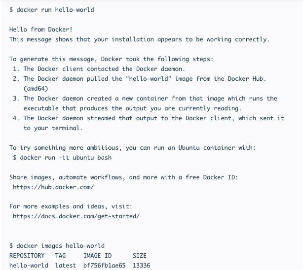

## **Como Começar a Usar o Docker no Ubuntu**

Como o Docker já foi instalado, tudo o que você precisa agora é usar a imagem de teste para verificar se tudo está funcionando como deveria. Faça isso usando o comando:

```bash
sudo docker run hello-world
```

Agora, se você quiser procurar por imagens disponíveis, você só precisa usar o seguinte comando:

```bash
sudo docker search [search_query]
```

Basta substituir sua consulta (query) pelo texto em colchetes.

Por exemplo, se você quer procurar por uma imagem relacionada ao Debian, o comando que você deve usar e a informação que será mostrada são:

```bash
sudo docker search debian
```



Então, para fazer o download da imagem para o seu computador, use o nome da imagem junto com o comando a seguir:

```bash
sudo docker pull [image_name]
```

No mundo real, o comando se pareceria também com:

```bash
sudo docker pull debian
```

Normalmente, os usuários têm várias imagens no próprio sistema. Podemos listar todas elas usando:

```bash
sudo docker images
```

A listagem vai ser bem parecida com a lista que você recebe quando você faz uma pesquisa (query).

Depois disso, você pode executar a imagem usando o comando pull e a ID da imagem.

```bash
sudo docker run -i -t [image]
```

Existem opções que estendem a funcionalidade do comando. Por exemplo, a opção **-i** faz com que a execução da imagem seja interativa. Já a opção **-d** faz com que ela aconteça em segundo plano.

Assim que estiver executando uma imagem, podemos terminar a execução usando a combinação de teclas **CTRL+D**.

Finalmente, se você quiser usar o Docker sem privilégios root, basta usar o comando abaixo:

```bash
sudo usermod -aG docker $(whoami)
```
Depois disso, reinicie o sistema e as alterações serão aplicadas.

Fonte: [Hostinger Tutoriais](https://www.hostinger.com.br/tutoriais/instalar-docker-ubuntu)